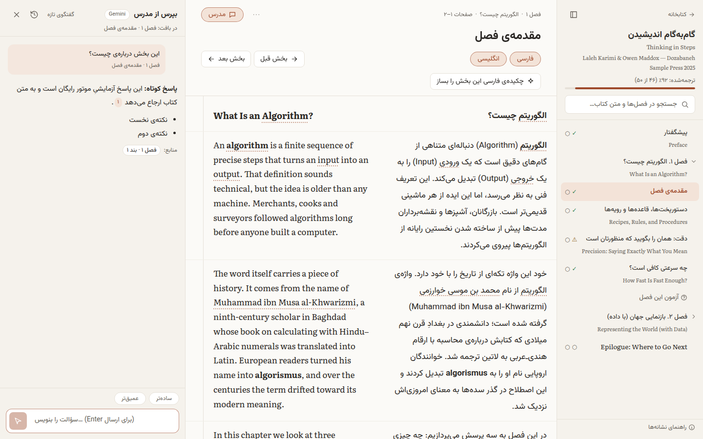

# دوزبانه · Dozabaneh

[](https://github.com/Fathifarshad/Books-Translator2/actions/workflows/ci.yml)
[](LICENSE)

**Turn an English book PDF into a carefully edited Persian translation and read both side by side, with an AI tutor
that answers questions about the page you are reading.** Free to run, private (everything stays on your computer),
Windows / macOS / Linux, and readable on phones.

**راهنمای فارسی:** [README.fa.md](README.fa.md) · راهنمای قدم‌به‌قدم: [docs/GUIDE.fa.md](docs/GUIDE.fa.md)



## Quick start (no programming needed)

1. Install **Node.js LTS** from <https://nodejs.org> (Windows: `winget install OpenJS.NodeJS.LTS`).
2. Download this project: green **Code** button → **Download ZIP** (or the latest
   [release](https://github.com/Fathifarshad/Books-Translator2/releases)), then unzip it.
3. Start it:
   - **Windows:** double-click **`start.cmd`**
   - **macOS / Linux:** run `./start.sh` in a terminal inside the folder

The first start installs everything (a few minutes). The app then opens at <http://localhost:8787> with an original
sample book. Keep the window open while you use it; close it (or press Ctrl+C) to stop.

## What it does

| Step | |
|---|---|
| **PDF → structured book** | pdf.js text extraction, running heads/page numbers removed, broken paragraphs merged, de-hyphenation, two-column pages, chapters and sections from the outline or the printed contents page. **Scanned PDFs are OCR'd** automatically (tesseract.js). You review and fix the structure before translating. |
| **Glossary first** | Book brief + a book-specific glossary that you approve, so every term is translated the same way everywhere. |
| **Translate → edit → QA** | Translation, then a separate editorial pass («ویراستاری دقیق») with minimum necessary edits, deterministic Persian typography (ZWNJ, punctuation, digits) and automated checks (numbers, markup, glossary, untranslated text) feeding a review queue. Your own edits are never overwritten. |
| **Parallel reader** | Four RTL columns: contents · Persian · English · tutor. Glossary pop-ups, select text → «بپرس درباره‌ی این», section summaries, chapter quizzes, search, light/sepia/dark themes, keyboard shortcuts. |
| **AI tutor** | Streams answers grounded in the book, with clickable citations to the exact paragraphs. |
| **Phones** | One-file **offline copy** of a translated book (send it by Telegram/WhatsApp, opens in any browser without internet), or password-protected read-only access through `pnpm share`. Installable as an app. |

## AI engines — all free options

Choose an engine per task in **Settings → موتور هوش مصنوعی**. Keys are encrypted on your computer and never reach the
browser.

| Engine | Cost | Notes |
|---|---|---|
| **Claude Code** (agent mode, default) | included in a Claude Pro/Max subscription | The app writes work batches; run `/process-batches` in Claude Code inside this folder and Claude (e.g. Opus 5.5) translates and edits with the project's prompts and Persian style guide. Highest quality, no API key. |
| **Google Gemini** | free tier | Paste a key from Google AI Studio; tested automatically. |
| **OpenRouter** | free models | One-click connect. |
| **Ollama** | free, local/offline | Any local model, or Ollama's cloud models. |
| **Mock** | free | Try the whole flow without AI. |

Free-tier limits are respected automatically: when a daily quota runs out, the pipeline waits and resumes by itself.

## For developers

```bash
corepack enable
pnpm install
pnpm dev            # API http://localhost:8787 + web http://localhost:5173
pnpm lint && pnpm typecheck && pnpm test && pnpm e2e
```

Monorepo: `apps/web` (React 19 SPA) · `apps/api` (Fastify + SQLite + job queue + agent CLI) ·
`packages/{pdf,ai,core,text,shared}` · `prompts/` (shared by every engine). Design and decisions:
[docs/SPEC.md](docs/SPEC.md), [docs/DECISIONS.md](docs/DECISIONS.md), [docs/PRD.md](docs/PRD.md). Contributions are
welcome — see [CONTRIBUTING.md](CONTRIBUTING.md).

## Copyright & privacy

Translate only books you have the right to use; translations are for personal study. The repository contains no
copyrighted book text (fixtures are synthetic and the sample book is original). Your books, translations and keys live
in the git-ignored `data/` folder on your computer.

## License

[MIT](LICENSE). Fonts are under the SIL Open Font License.
